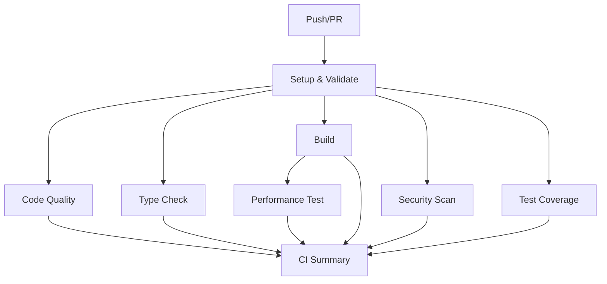

# GitHub Actions CI/CD Configuration

This directory contains the GitHub Actions workflows and configuration files for the Manifest Tariff Guard application.

## 📋 Workflows Overview

### 🔄 Main CI Pipeline (`ci.yml`)

**Triggers**: Push to `main`/`develop`, Pull Requests, Manual dispatch

**Jobs**:

1. **Setup & Validate** - Environment setup and dependency caching
2. **Code Quality & Linting** - ESLint, Prettier, and unused imports check
3. **Type Checking** - TypeScript type validation
4. **Build Verification** - Next.js build with caching
5. **Security Scanning** - npm audit, Snyk, and CodeQL analysis
6. **Performance Monitoring** - Lighthouse CI performance testing
7. **Test Coverage** - Jest tests with Codecov reporting (when implemented)
8. **CI Summary** - Consolidated results and status reporting

### 🔍 Dependency Review (`dependency-review.yml`)

**Triggers**: Pull Requests to `main`

- Reviews new dependencies for security vulnerabilities
- Checks license compatibility
- Blocks PRs with security issues or incompatible licenses

### 🤖 Auto-merge (`auto-merge.yml`)

**Triggers**: Dependabot PRs

- Automatically merges minor and patch dependency updates
- Only merges when all CI checks pass
- Helps maintain up-to-date dependencies

### 🧹 Stale Issues (`stale-issues.yml`)

**Triggers**: Daily schedule (midnight UTC)

- Marks inactive issues and PRs as stale after 30 days
- Closes stale items after 7 additional days
- Keeps repository organized and current

## 🚀 Features

### ⚡ Performance Optimizations

- **Intelligent Caching**: Node modules, Next.js build cache
- **Parallel Execution**: Independent jobs run simultaneously
- **Conditional Jobs**: Skip unnecessary work based on conditions
- **Artifact Management**: Efficient build artifact sharing

### 🛡️ Security Features

- **CodeQL Analysis**: Static code analysis for vulnerabilities
- **Dependency Scanning**: Snyk and npm audit integration
- **License Compliance**: Automated license checking
- **Secret Scanning**: GitHub's built-in secret detection

### 📊 Quality Assurance

- **Comprehensive Linting**: ESLint with strict rules
- **Code Formatting**: Prettier consistency checks
- **Type Safety**: TypeScript strict mode validation
- **Performance Monitoring**: Lighthouse CI integration

## 🔧 Setup Requirements

### Required Secrets (Optional)

Add these to your repository secrets for enhanced functionality:

```bash
SNYK_TOKEN          # For Snyk security scanning
CODECOV_TOKEN       # For test coverage reporting
```

### Repository Settings

1. **Branch Protection Rules** (Recommended):
   - Require status checks to pass
   - Require branches to be up to date
   - Require review from code owners

2. **Environment Variables**:
   - Configure any environment-specific variables
   - Use GitHub Environments for deployment stages

## 📁 File Structure

```
.github/
├── workflows/
│   ├── ci.yml                 # Main CI pipeline
│   ├── dependency-review.yml  # Dependency security review
│   ├── auto-merge.yml         # Dependabot auto-merge
│   └── stale-issues.yml       # Stale issue management
├── ISSUE_TEMPLATE/
│   ├── bug_report.yml         # Bug report template
│   └── feature_request.yml    # Feature request template
├── dependabot.yml             # Dependabot configuration
├── pull_request_template.md   # PR template
├── SECURITY.md                # Security policy
└── README.md                  # This file
```

## 🔄 CI Pipeline Flow



## 📈 Monitoring & Reporting

### Status Badges

Add these badges to your main README.md:

```markdown
[](https://github.com/helloemzy/manifest/actions/workflows/ci.yml)
[](https://github.com/helloemzy/manifest/actions/workflows/dependency-review.yml)
```

### Metrics Tracked

- **Build Success Rate**: Percentage of successful builds
- **Test Coverage**: Code coverage percentage (when tests added)
- **Performance Scores**: Lighthouse metrics
- **Security Issues**: Vulnerability count and severity
- **Code Quality**: ESLint warnings/errors

## 🔧 Customization

### Adding Tests

When you add Jest tests to your project:

1. Add Jest configuration to `package.json` or create `jest.config.js`
2. The CI will automatically detect and run tests
3. Coverage reports will be generated and uploaded to Codecov

### Performance Thresholds

Modify `lighthouserc.js` to adjust performance thresholds:

```javascript
// lighthouserc.js
assertions: {
  'categories:performance': ['warn', { minScore: 0.8 }],
  'categories:accessibility': ['error', { minScore: 0.9 }],
  // ... adjust as needed
}
```

### Security Scanning

Configure Snyk and other security tools in the CI workflow based on your needs.

## 🆘 Troubleshooting

### Common Issues

1. **Build Failures**
   - Check Node.js version compatibility
   - Verify all dependencies are properly installed
   - Review build logs for specific errors

2. **Lint Failures**
   - Run `npm run lint:fix` locally
   - Ensure code follows ESLint configuration
   - Check for unused imports

3. **Type Check Failures**
   - Run `npm run type-check` locally
   - Fix TypeScript errors in your code
   - Ensure all types are properly defined

4. **Performance Issues**
   - Review Lighthouse reports for specific recommendations
   - Optimize images and assets
   - Review bundle size and code splitting

## 🤝 Contributing

When contributing to this CI/CD configuration:

1. Test changes in a fork first
2. Update documentation for new features
3. Follow existing patterns and conventions
4. Consider backward compatibility

## 📞 Support

For issues with the CI/CD pipeline:

- Check the Actions tab for detailed logs
- Review this documentation
- Open an issue using the provided templates
- Contact: @helloemzy
