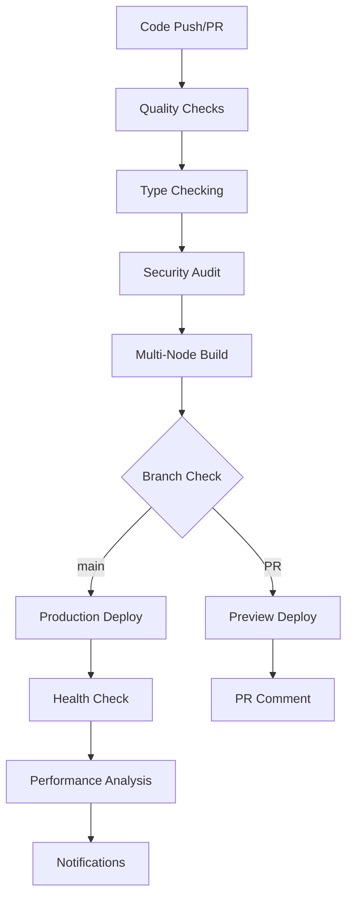

# Vercel Deployment Pipeline Overview

## 🚀 Automated CI/CD Pipeline for Manifest TariffGuard

This repository is configured with a comprehensive CI/CD pipeline that automates testing, building, and deployment to Vercel.

## Pipeline Architecture

### 🔄 Workflow Types

1. **Continuous Integration (`ci.yml`)**
   - Runs on every push and PR
   - Code quality checks, type checking, security audits
   - Multi-node build testing (Node.js 18.x & 20.x)

2. **Vercel Deployment (`vercel-deploy.yml`)**
   - Preview deployments for PRs
   - Production deployments for main branch
   - Performance monitoring with Lighthouse CI

## 🔧 Configuration Files

| File                                  | Purpose                | Key Features                                  |
| ------------------------------------- | ---------------------- | --------------------------------------------- |
| `.github/workflows/ci.yml`            | Continuous integration | Quality checks, type checking, security audit |
| `.github/workflows/vercel-deploy.yml` | Deployment pipeline    | Preview & production deployments              |
| `vercel.json`                         | Vercel configuration   | Optimized build settings, caching, headers    |
| `lighthouserc.js`                     | Performance monitoring | Core Web Vitals, accessibility checks         |

## 🌍 Deployment Environments

### Production

- **Branch**: `main`
- **URL**: `https://manifest.emily-sparks.com`
- **Trigger**: Push to main branch or manual dispatch
- **Features**:
  - Full quality gate pipeline
  - Health check verification
  - Performance analysis
  - Automated notifications

### Preview

- **Branch**: Any PR branch
- **URL**: Auto-generated preview URLs
- **Trigger**: Pull requests
- **Features**:
  - Same quality checks as production
  - Automatic PR comments with preview URL
  - Preview environment isolation

## 🛡️ Quality Gates

### Code Quality

- ✅ ESLint with strict rules
- ✅ Prettier formatting validation
- ✅ TypeScript type checking
- ✅ Security audit (npm audit)

### Build Validation

- ✅ Multi-node version testing (18.x, 20.x)
- ✅ Environment variable validation
- ✅ Build artifact optimization
- ✅ Bundle size analysis

### Deployment Health

- ✅ Application health check endpoint
- ✅ Environment configuration validation
- ✅ Service connectivity verification
- ✅ Performance metrics collection

## 📊 Performance Monitoring

### Lighthouse CI Integration

- **Metrics Tracked**: Performance, Accessibility, Best Practices, SEO
- **Core Web Vitals**: FCP, LCP, CLS, TBT
- **Thresholds**:
  - Performance: ≥80%
  - Accessibility: ≥90% (error level)
  - Best Practices: ≥80%
  - SEO: ≥80%

### Build Optimization

- **Caching Strategy**:
  - NPM packages cached across builds
  - Build artifacts cached for 1 hour
  - Static assets cached for 1 year
- **Bundle Analysis**: Automatic size reporting
- **Region Deployment**: US East (iad1) and West (sfo1)

## 🔐 Security Features

### Headers & CSP

```json
{
  "X-Frame-Options": "DENY",
  "X-Content-Type-Options": "nosniff",
  "X-XSS-Protection": "1; mode=block",
  "Referrer-Policy": "strict-origin-when-cross-origin"
}
```

### Environment Security

- Secrets managed via GitHub Secrets
- Environment variable validation
- No sensitive data in repository
- Minimal token permissions

## ⚙️ Configuration Requirements

### GitHub Secrets

```
VERCEL_TOKEN=your_vercel_deployment_token
VERCEL_ORG_ID=emily-sparks_org_id
VERCEL_PROJECT_ID=manifest_project_id
SUPABASE_URL=your_supabase_project_url
SUPABASE_ANON_KEY=your_supabase_anonymous_key
```

### Vercel Environment Variables

- Production: Same as GitHub secrets
- Preview: Automatically inherited or overridden

## 🚦 Pipeline Flow



## 📈 Monitoring & Alerts

### GitHub Actions Notifications

- ✅ Success/failure status in GitHub
- 🔗 Preview URLs in PR comments
- 📊 Performance metrics in logs
- 🚨 Health check failures

### Vercel Dashboard

- Real-time deployment status
- Build logs and analytics
- Performance metrics
- Error monitoring

## 🔧 Local Development

### Environment Setup

```bash
# Install dependencies
npm ci

# Validate environment
npm run env:validate

# Run development server
npm run dev

# Build for production
npm run build
```

### Quality Checks (Run Locally)

```bash
# Full validation pipeline
npm run validate:full

# Individual checks
npm run type-check
npm run lint:strict
npm run format:check
```

## 🐛 Troubleshooting

### Common Issues

1. **Build Failures**
   - Check environment variables in both GitHub and Vercel
   - Verify Node.js version compatibility
   - Review TypeScript errors in logs

2. **Deployment Failures**
   - Validate Vercel token permissions
   - Check project and org IDs
   - Verify build artifacts generation

3. **Performance Issues**
   - Review Lighthouse CI reports
   - Check bundle size analysis
   - Monitor Core Web Vitals

### Debug Commands

```bash
# Local health check
curl http://localhost:3000/api/health

# Build analysis
npm run build && du -sh .next/

# Environment validation
npm run env:validate
```

## 📞 Support

For deployment issues:

1. Check GitHub Actions logs
2. Review Vercel deployment logs
3. Verify configuration in `.github/DEPLOYMENT_SETUP.md`
4. Test locally with production build

---

**Pipeline Status**: ✅ Fully Configured  
**Last Updated**: 2025-08-30  
**Maintained By**: emily-sparks team
