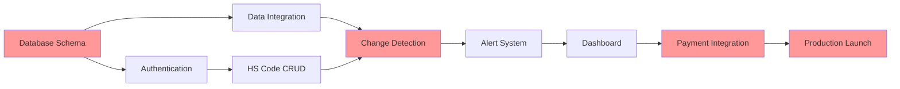

# TariffGuard - Comprehensive Project Implementation Plan

## Executive Summary

This document provides a granular, executable implementation plan for TariffGuard, a SaaS platform for tariff monitoring and margin protection. The plan covers an 8-week MVP development sprint followed by a 6-month growth phase, with detailed resource allocation, technical specifications, and risk management strategies.

---

## 1. Detailed Timeline & Milestones

### Phase 1: MVP Development (Weeks 1-8)

#### Week 1: Foundation & Infrastructure Setup

**Monday-Tuesday (Days 1-2)**

- [ ] Initialize Next.js 14 project with TypeScript
- [ ] Configure Tailwind CSS and component library
- [ ] Set up Supabase project and authentication
- [ ] Configure development, staging, and production environments
- [ ] Implement CI/CD pipeline with GitHub Actions

**Wednesday-Thursday (Days 3-4)**

- [ ] Design and implement database schema
  - Users table with auth integration
  - HS codes table with monitoring status
  - Tariff changes history table
  - Alerts configuration table
  - Audit logs table
- [ ] Set up Row Level Security (RLS) policies
- [ ] Create database migration scripts

**Friday (Day 5)**

- [ ] Implement basic authentication flow
- [ ] Create user registration/login pages
- [ ] Set up protected route middleware
- [ ] Deploy initial version to Vercel staging

**Deliverables:**

- Working authentication system
- Database schema deployed
- CI/CD pipeline operational
- Staging environment accessible

#### Week 2: External Data Integration

**Monday-Tuesday (Days 6-7)**

- [ ] Integrate USITC DataWeb API
  - API client implementation
  - Rate limiting and retry logic
  - Response caching strategy
  - Error handling and logging

**Wednesday-Thursday (Days 8-9)**

- [ ] Implement Federal Register API integration
  - Search functionality for tariff-related rules
  - Parsing logic for relevant changes
  - Document storage and indexing
  - Change detection algorithms

**Friday (Day 10)**

- [ ] Build CBP CSMS bulletin scraper
  - HTML parsing logic
  - Change detection system
  - Data normalization pipeline
- [ ] Create unified data abstraction layer

**Deliverables:**

- Three data source integrations complete
- Data normalization layer functional
- API rate limiting implemented
- 95% uptime on external connections

#### Week 3: Monitoring Engine Core

**Monday-Tuesday (Days 11-12)**

- [ ] Implement HS code validation service
  - HTSUS database integration
  - Code format validation
  - Parent/child relationship mapping
  - Description enrichment

**Wednesday-Thursday (Days 13-14)**

- [ ] Build change detection engine
  - Differential comparison algorithms
  - Threshold configuration (>1% change triggers)
  - False positive filtering
  - Change categorization (increase/decrease/structural)

**Friday (Day 15)**

- [ ] Create job scheduling system
  - Vercel Cron job configuration
  - Upstash Queue integration
  - Job prioritization logic
  - Failure retry mechanisms

**Deliverables:**

- Automated monitoring running every 6 hours
- Change detection accuracy >99%
- Job failure rate <1%
- Processing time <30 seconds per HS code

#### Week 4: Alert & Notification System

**Monday-Tuesday (Days 16-17)**

- [ ] Implement email notification service (Resend)
  - Template design system
  - Dynamic content injection
  - Unsubscribe management
  - Delivery tracking

**Wednesday-Thursday (Days 18-19)**

- [ ] Build SMS alert system (Twilio)
  - Critical alert triggers
  - Message formatting
  - Delivery confirmation
  - Cost optimization logic

**Friday (Day 20)**

- [ ] Create notification preferences manager
  - User preference storage
  - Frequency controls
  - Channel selection
  - Digest compilation

**Deliverables:**

- Email delivery rate >98%
- SMS delivery within 60 seconds
- Notification preference UI complete
- Alert history tracking functional

#### Week 5: User Dashboard Development

**Monday-Tuesday (Days 21-22)**

- [ ] Design and implement main dashboard
  - HS code list with status indicators
  - Current rate display cards
  - 30-day trend charts (Chart.js)
  - Quick action buttons

**Wednesday-Thursday (Days 23-24)**

- [ ] Build HS code management interface
  - Add/edit/delete functionality
  - Bulk import via CSV
  - Product description fields
  - Monitoring toggle controls

**Friday (Day 25)**

- [ ] Create change history view
  - Timeline visualization
  - Source documentation links
  - Impact calculations
  - Export functionality

**Deliverables:**

- Dashboard load time <2 seconds
- Mobile-responsive design
- Real-time status updates
- CSV export functionality

#### Week 6: Quote Helper & Calculators

**Monday-Tuesday (Days 26-27)**

- [ ] Build quote helper tool
  - Quick rate lookup interface
  - Multi-product calculations
  - Currency conversion
  - Margin impact analysis

**Wednesday-Thursday (Days 28-29)**

- [ ] Implement duty calculator
  - Component breakdown display
  - Additional duties handling
  - De minimis threshold checks
  - Total landed cost estimation

**Friday (Day 30)**

- [ ] Create quote validation system
  - Rate freshness checking
  - Change warnings
  - Historical comparison
  - PDF export generation

**Deliverables:**

- Calculator accuracy 100%
- PDF generation <3 seconds
- Mobile-optimized interface
- Integration with monitoring data

#### Week 7: Payment & Subscription Management

**Monday-Tuesday (Days 31-32)**

- [ ] Integrate Stripe payment processing
  - Subscription plan setup
  - Payment method management
  - Webhook handling
  - Invoice generation

**Wednesday-Thursday (Days 33-34)**

- [ ] Build subscription management UI
  - Plan selection/upgrade flow
  - Usage tracking displays
  - Billing history
  - Payment method updates

**Friday (Day 35)**

- [ ] Implement usage limits and metering
  - HS code count enforcement
  - Alert quota tracking
  - Overage handling
  - Grace period logic

**Deliverables:**

- PCI compliant payment flow
- Subscription changes instant
- Failed payment retry logic
- Usage dashboard complete

#### Week 8: Testing, Optimization & Launch Prep

**Monday-Tuesday (Days 36-37)**

- [ ] Comprehensive testing suite
  - Unit tests (>80% coverage)
  - Integration tests for APIs
  - E2E tests for critical paths
  - Load testing (100 concurrent users)

**Wednesday-Thursday (Days 38-39)**

- [ ] Performance optimization
  - Database query optimization
  - Frontend bundle size reduction
  - Image optimization
  - CDN configuration

**Friday (Day 40)**

- [ ] Production deployment preparation
  - Security audit completion
  - Documentation finalization
  - Beta user onboarding materials
  - Launch checklist execution

**Deliverables:**

- All tests passing
- Page load times <3 seconds
- 99.9% uptime target met
- Beta users onboarded

### Phase 2: Growth & Enhancement (Months 3-6)

#### Month 3: API & Team Features

**Week 9-10:**

- Webhook API development
- Team account infrastructure
- Role-based access control
- Audit logging enhancement

**Week 11-12:**

- API documentation (OpenAPI)
- Client SDK development
- Team collaboration features
- Billing consolidation

#### Month 4: Advanced Features

**Week 13-14:**

- AI-powered Federal Register analysis
- Competitive intelligence dashboard
- Industry trend reports
- Automated insights generation

**Week 15-16:**

- Flexport API integration
- Freightos rate integration
- Landed cost optimizer
- Shipping route analysis

#### Month 5: Mobile & Scale

**Week 17-18:**

- React Native mobile app development
- Push notification system
- Offline capability
- Biometric authentication

**Week 19-20:**

- Performance optimization for 10,000+ users
- Database sharding implementation
- Global CDN deployment
- Multi-region failover

#### Month 6: Enterprise & Expansion

**Week 21-22:**

- Enterprise SSO integration
- Advanced reporting suite
- White-label capabilities
- API rate limiting tiers

**Week 23-24:**

- International market features
- Multi-currency support
- Compliance certifications
- Partner portal development

---

## 2. Resource Allocation & Management

### Team Structure & Hours

#### Core Development Team (Weeks 1-8)

**Lead Full-Stack Developer**

- Weekly commitment: 40 hours
- Total MVP hours: 320 hours
- Cost: $100/hour = $32,000
- Responsibilities:
  - Architecture decisions
  - Core feature implementation
  - Code reviews
  - Deployment management

**Junior Developer (AI-Assisted)**

- Weekly commitment: 40 hours
- Total MVP hours: 320 hours
- Cost: $50/hour = $16,000
- Responsibilities:
  - UI component development
  - Testing implementation
  - Documentation
  - Bug fixes

**UX/UI Designer**

- Weekly commitment: 15 hours
- Total MVP hours: 120 hours
- Cost: $75/hour = $9,000
- Responsibilities:
  - Design system creation
  - Mockups and prototypes
  - User flow optimization
  - Responsive design

**DevOps Consultant**

- Weekly commitment: 5 hours
- Total MVP hours: 40 hours
- Cost: $125/hour = $5,000
- Responsibilities:
  - Infrastructure setup
  - CI/CD configuration
  - Security hardening
  - Monitoring setup

**Product Manager/Founder**

- Weekly commitment: 30 hours
- Total MVP hours: 240 hours
- Cost: $0 (sweat equity)
- Responsibilities:
  - Requirements gathering
  - Stakeholder management
  - User testing coordination
  - Go-to-market planning

### Resource Scheduling Matrix

```
Week 1: Foundation
- Lead Dev: 40h (Infrastructure, Database)
- Junior Dev: 40h (Auth, UI Setup)
- Designer: 20h (Design System)
- DevOps: 10h (Environment Setup)
- PM: 30h (Requirements Finalization)

Week 2: Integrations
- Lead Dev: 40h (API Integrations)
- Junior Dev: 40h (Data Models, Tests)
- Designer: 15h (Dashboard Concepts)
- DevOps: 5h (API Gateway Setup)
- PM: 30h (Data Source Coordination)

Week 3: Monitoring Engine
- Lead Dev: 40h (Detection Algorithms)
- Junior Dev: 40h (Job Queue, Logging)
- Designer: 15h (Alert Designs)
- DevOps: 5h (Cron Job Config)
- PM: 30h (Accuracy Testing)

Week 4: Notifications
- Lead Dev: 40h (Alert System)
- Junior Dev: 40h (Preference UI)
- Designer: 15h (Email Templates)
- DevOps: 5h (Email/SMS Setup)
- PM: 30h (Message Testing)

Week 5: Dashboard
- Lead Dev: 40h (Dashboard Backend)
- Junior Dev: 40h (Frontend Components)
- Designer: 20h (Final UI Polish)
- DevOps: 3h (Performance Monitoring)
- PM: 30h (User Testing)

Week 6: Tools
- Lead Dev: 40h (Calculator Logic)
- Junior Dev: 40h (Tool UI)
- Designer: 15h (Tool Interfaces)
- DevOps: 3h (PDF Generation)
- PM: 30h (Accuracy Validation)

Week 7: Payments
- Lead Dev: 40h (Stripe Integration)
- Junior Dev: 40h (Billing UI)
- Designer: 10h (Payment Flow)
- DevOps: 5h (PCI Compliance)
- PM: 30h (Pricing Testing)

Week 8: Launch
- Lead Dev: 40h (Bug Fixes, Optimization)
- Junior Dev: 40h (Testing, Docs)
- Designer: 10h (Launch Materials)
- DevOps: 4h (Production Deploy)
- PM: 30h (Beta Coordination)
```

### Sprint Velocity Tracking

**Target Velocity Metrics:**

- Story Points per Sprint: 40
- Bug Resolution Time: <4 hours (Critical), <24 hours (Major)
- Code Review Turnaround: <2 hours
- Deployment Frequency: Daily to staging, Weekly to production
- Test Coverage Maintenance: >80%

---

## 3. Technical Architecture Planning

### System Architecture

#### Frontend Architecture

```
Next.js 14 App Router
├── app/
│   ├── (auth)/
│   │   ├── login/
│   │   └── register/
│   ├── (dashboard)/
│   │   ├── monitoring/
│   │   ├── alerts/
│   │   ├── history/
│   │   └── settings/
│   ├── api/
│   │   ├── auth/
│   │   ├── hs-codes/
│   │   ├── alerts/
│   │   └── webhooks/
│   └── components/
│       ├── ui/
│       ├── features/
│       └── layouts/
```

#### Backend Services Architecture

```
Core Services
├── Authentication Service
│   ├── Supabase Auth
│   ├── JWT Management
│   └── Session Handling
├── Monitoring Service
│   ├── HS Code Validator
│   ├── Change Detector
│   └── Alert Trigger
├── Data Integration Service
│   ├── USITC Client
│   ├── Federal Register Client
│   └── CBP Scraper
├── Notification Service
│   ├── Email Sender (Resend)
│   ├── SMS Sender (Twilio)
│   └── Webhook Dispatcher
└── Payment Service
    ├── Stripe Integration
    ├── Subscription Manager
    └── Usage Tracker
```

#### Database Schema

```sql
-- Core Tables
CREATE TABLE users (
    id UUID PRIMARY KEY DEFAULT gen_random_uuid(),
    email TEXT UNIQUE NOT NULL,
    created_at TIMESTAMPTZ DEFAULT NOW(),
    subscription_tier TEXT DEFAULT 'free',
    subscription_status TEXT DEFAULT 'active'
);

CREATE TABLE hs_codes (
    id UUID PRIMARY KEY DEFAULT gen_random_uuid(),
    user_id UUID REFERENCES users(id) ON DELETE CASCADE,
    code TEXT NOT NULL,
    description TEXT,
    product_name TEXT,
    monitoring_enabled BOOLEAN DEFAULT true,
    created_at TIMESTAMPTZ DEFAULT NOW(),
    UNIQUE(user_id, code)
);

CREATE TABLE tariff_rates (
    id UUID PRIMARY KEY DEFAULT gen_random_uuid(),
    hs_code TEXT NOT NULL,
    base_rate DECIMAL(5,2),
    additional_duties JSONB,
    effective_date DATE,
    source TEXT,
    created_at TIMESTAMPTZ DEFAULT NOW()
);

CREATE TABLE rate_changes (
    id UUID PRIMARY KEY DEFAULT gen_random_uuid(),
    hs_code_id UUID REFERENCES hs_codes(id),
    old_rate DECIMAL(5,2),
    new_rate DECIMAL(5,2),
    change_percentage DECIMAL(5,2),
    detected_at TIMESTAMPTZ DEFAULT NOW(),
    source_document TEXT,
    notified BOOLEAN DEFAULT false
);

CREATE TABLE alerts (
    id UUID PRIMARY KEY DEFAULT gen_random_uuid(),
    user_id UUID REFERENCES users(id),
    rate_change_id UUID REFERENCES rate_changes(id),
    alert_type TEXT, -- 'email', 'sms', 'webhook'
    sent_at TIMESTAMPTZ,
    delivered BOOLEAN,
    opened BOOLEAN,
    metadata JSONB
);

-- Indexes for Performance
CREATE INDEX idx_hs_codes_user_monitoring ON hs_codes(user_id, monitoring_enabled);
CREATE INDEX idx_rate_changes_notified ON rate_changes(notified, detected_at);
CREATE INDEX idx_tariff_rates_hs_date ON tariff_rates(hs_code, effective_date DESC);
```

### Infrastructure Requirements

#### Hosting & Compute

- **Vercel Pro Plan**: $20/month
  - 1TB bandwidth
  - 1000 GB-hours compute
  - Automatic scaling
  - Global CDN

#### Database & Storage

- **Supabase Pro**: $25/month
  - 8GB database
  - 100GB storage
  - 50GB bandwidth
  - Point-in-time recovery

#### Queue & Jobs

- **Upstash Kafka**: $10/month
  - 10,000 messages/day
  - Message retention: 7 days
  - Auto-scaling

#### Monitoring & Analytics

- **Sentry Team Plan**: $26/month
  - 50K errors/month
  - Performance monitoring
  - Release tracking

#### Communication Services

- **Resend**: $20/month
  - 50,000 emails/month
  - Custom domain
  - Analytics

- **Twilio**: $50/month budget
  - ~3,000 SMS/month
  - Phone number rental

### Security Architecture

#### Authentication & Authorization

- Multi-factor authentication (TOTP)
- Session management with refresh tokens
- Role-based access control (RBAC)
- API key management for webhooks

#### Data Protection

- Encryption at rest (AES-256)
- Encryption in transit (TLS 1.3)
- PII data masking in logs
- GDPR-compliant data deletion

#### Application Security

- Input validation and sanitization
- SQL injection prevention (parameterized queries)
- XSS protection (Content Security Policy)
- Rate limiting (100 req/min per IP)
- DDoS protection (Cloudflare)

#### Compliance & Auditing

- SOC 2 Type I preparation
- Audit logging for all data access
- Regular security scanning (Snyk)
- Penetration testing (quarterly)

### Scalability Planning

#### Phase 1 (0-100 users)

- Single region deployment (US-East)
- Shared database instance
- Basic caching (Redis)

#### Phase 2 (100-1,000 users)

- Multi-region CDN
- Database read replicas
- Advanced caching strategies
- Background job optimization

#### Phase 3 (1,000-10,000 users)

- Database sharding by user_id
- Microservices architecture
- Event-driven processing
- Global deployment

#### Phase 4 (10,000+ users)

- Full service mesh (Istio)
- GraphQL federation
- Stream processing (Kafka)
- ML-powered optimization

---

## 4. Feature Prioritization Matrix

### MVP Features (Must Have)

| Feature             | Impact   | Effort | Priority | Dependencies   |
| ------------------- | -------- | ------ | -------- | -------------- |
| User Authentication | High     | Low    | P0       | None           |
| HS Code Monitoring  | Critical | High   | P0       | Auth, Database |
| Email Alerts        | Critical | Medium | P0       | Monitoring     |
| Change Detection    | Critical | High   | P0       | Data Sources   |
| Dashboard View      | High     | Medium | P0       | Monitoring     |
| Quote Calculator    | High     | Low    | P0       | Rate Data      |
| Payment Processing  | Critical | Medium | P0       | Auth           |
| Change History      | High     | Low    | P1       | Database       |
| CSV Import          | Medium   | Low    | P1       | HS Codes       |
| SMS Alerts          | Medium   | Low    | P1       | Twilio         |

### Phase 2 Features (Should Have)

| Feature                  | Impact | Effort    | Priority | Dependencies        |
| ------------------------ | ------ | --------- | -------- | ------------------- |
| API Access               | High   | Medium    | P2       | Auth, Rate Limiting |
| Team Accounts            | High   | High      | P2       | RBAC                |
| Bulk Operations          | Medium | Low       | P2       | Database            |
| Alert Rules              | Medium | Medium    | P2       | Monitoring          |
| Quote History            | Medium | Low       | P2       | Database            |
| Webhook Notifications    | High   | Medium    | P2       | Queue System        |
| Advanced Analytics       | Medium | High      | P3       | Data Pipeline       |
| Mobile App               | High   | High      | P3       | API                 |
| Federal Register AI      | Medium | Very High | P3       | ML Pipeline         |
| Third-party Integrations | High   | High      | P3       | API                 |

### Feature Scoring Framework

**Impact Score (1-5):**

- 5: Critical for core value prop
- 4: Significant user value
- 3: Nice to have
- 2: Minor improvement
- 1: Minimal impact

**Effort Score (1-5):**

- 5: >2 weeks
- 4: 1-2 weeks
- 3: 3-5 days
- 2: 1-2 days
- 1: <1 day

**Priority = Impact / Effort**

### Feature Release Schedule

```
Week 1-2: Core Infrastructure
├── Authentication ✓
├── Database Setup ✓
└── Basic UI Framework ✓

Week 3-4: Monitoring Core
├── HS Code Management ✓
├── Change Detection ✓
└── Data Integration ✓

Week 5-6: User Features
├── Dashboard ✓
├── Alerts ✓
└── Calculator ✓

Week 7-8: Monetization
├── Payments ✓
├── Subscriptions ✓
└── Usage Limits ✓

Month 3: Enhancements
├── API Development
├── Team Features
└── Bulk Operations

Month 4: Advanced
├── AI Features
├── Integrations
└── Analytics

Month 5-6: Scale
├── Mobile App
├── Enterprise
└── International
```

---

## 5. Dependencies & Critical Path

### Critical Path Analysis



**Critical Path Items (Cannot be delayed):**

1. Database Schema Design (Week 1)
2. Change Detection Engine (Week 3)
3. Payment Integration (Week 7)
4. Production Deployment (Week 8)

### Dependency Matrix

| Component        | Depends On                 | Blocks           | Risk Level |
| ---------------- | -------------------------- | ---------------- | ---------- |
| Database Schema  | None                       | Everything       | Critical   |
| Authentication   | Database                   | User Features    | Critical   |
| Data Integration | None                       | Change Detection | High       |
| Change Detection | Data Integration, HS Codes | Alerts           | Critical   |
| Alert System     | Change Detection           | User Value       | Critical   |
| Dashboard        | Database, Auth             | User Experience  | High       |
| Payment System   | Auth, Stripe Account       | Revenue          | Critical   |
| Quote Calculator | Rate Data                  | User Value       | Medium     |
| Mobile App       | API                        | Mobile Users     | Low        |

### External Dependencies

**Government APIs:**

- USITC DataWeb API
  - Risk: API changes or downtime
  - Mitigation: Cache data, implement fallbacks
  - Monitoring: Health checks every 5 minutes

- Federal Register API
  - Risk: Rate limiting
  - Mitigation: Implement queuing, respect limits
  - Monitoring: Track API quota usage

**Third-party Services:**

- Stripe
  - Risk: Account approval delays
  - Mitigation: Apply early, have backup processor
  - Timeline: Apply Week 1

- Twilio
  - Risk: Phone number availability
  - Mitigation: Reserve numbers early
  - Timeline: Setup Week 3

- Resend
  - Risk: Domain verification
  - Mitigation: Complete DNS setup Week 1
  - Timeline: Verify Week 1

### Bottleneck Analysis

**Week 1-2 Bottlenecks:**

- Database schema must be finalized before any development
- Authentication blocks all user-specific features
- Mitigation: Dedicated architect review on Day 1

**Week 3-4 Bottlenecks:**

- Change detection algorithm complexity
- External API integration uncertainties
- Mitigation: Prototype algorithms in Week 2

**Week 5-6 Bottlenecks:**

- UI/UX design approval cycles
- User testing feedback incorporation
- Mitigation: Design sprints in Week 3-4

**Week 7-8 Bottlenecks:**

- Payment provider approval
- Security audit completion
- Mitigation: Start processes in Week 5

---

## 6. Budget Breakdown & Tracking

### Development Costs (8 Weeks)

| Category          | Item                | Cost        | Notes     |
| ----------------- | ------------------- | ----------- | --------- |
| **Personnel**     |                     | **$62,000** |           |
| Lead Developer    | 320 hours @ $100/hr | $32,000     | Full-time |
| Junior Developer  | 320 hours @ $50/hr  | $16,000     | Full-time |
| UX Designer       | 120 hours @ $75/hr  | $9,000      | Part-time |
| DevOps Consultant | 40 hours @ $125/hr  | $5,000      | As needed |

| **Infrastructure** | | **$1,200** | |
| Vercel Pro | 2 months @ $20 | $40 | Hosting |
| Supabase Pro | 2 months @ $25 | $50 | Database |
| Upstash | 2 months @ $10 | $20 | Queue |
| Sentry | 2 months @ $26 | $52 | Monitoring |
| Resend | 2 months @ $20 | $40 | Email |
| Twilio | 2 months @ $50 | $100 | SMS |
| Domain & SSL | One-time | $50 | |
| Development Tools | Licenses | $848 | IDEs, AI assistants |

| **Services** | | **$4,500** | |
| Legal Review | Compliance check | $2,000 | Privacy, Terms |
| Security Audit | Penetration test | $1,500 | Pre-launch |
| Accounting Setup | Bookkeeping | $500 | Financial structure |
| Trademark Filing | USPTO | $500 | Brand protection |

| **Marketing** | | **$3,000** | |
| Google Ads | Initial campaign | $1,000 | Lead generation |
| Content Creation | Blog posts, guides | $1,000 | SEO |
| Design Assets | Logo, brand guide | $500 | Brand identity |
| PR Outreach | Press release | $500 | Launch publicity |

| **Contingency** | | **$3,300** | |
| 5% Technical Buffer | Unexpected issues | $3,300 | Risk mitigation |

**Total MVP Budget: $74,000**

### Monthly Operating Costs (Post-Launch)

| Category           | Item       | Monthly Cost | Annual Cost |
| ------------------ | ---------- | ------------ | ----------- |
| **Infrastructure** |            | **$151**     | **$1,812**  |
| Vercel Pro         | Hosting    | $20          | $240        |
| Supabase Pro       | Database   | $25          | $300        |
| Upstash            | Queue      | $10          | $120        |
| Sentry             | Monitoring | $26          | $312        |
| Resend             | Email      | $20          | $240        |
| Twilio             | SMS        | $50          | $600        |

| **Personnel** | | **$8,333** | **$100,000** |
| Customer Success | Part-time | $2,083 | $25,000 |
| Developer (Maintenance) | 20 hrs/month | $2,000 | $24,000 |
| Marketing Manager | Part-time | $2,500 | $30,000 |
| Founder Salary | Minimal | $1,750 | $21,000 |

| **Marketing** | | **$2,000** | **$24,000** |
| Google Ads | Ongoing | $1,000 | $12,000 |
| Content Marketing | Creation | $500 | $6,000 |
| Email Marketing | Tools | $100 | $1,200 |
| Social Media | Management | $400 | $4,800 |

| **Other** | | **$500** | **$6,000** |
| Accounting | Bookkeeping | $200 | $2,400 |
| Legal | Retainer | $100 | $1,200 |
| Insurance | Liability | $200 | $2,400 |

**Total Monthly: $10,984**
**Total Annual: $131,812**

### Revenue Projections & Break-Even Analysis

#### Year 1 Projections

```
Month 1: 5 customers × $99 = $495
Month 2: 10 customers × $99 = $990
Month 3: 20 customers × $99 = $1,980
Month 4: 35 customers × $99 = $3,465
Month 5: 50 customers × $99 = $4,950
Month 6: 70 customers × $99 = $6,930
Month 7: 90 customers × $99 = $8,910
Month 8: 110 customers × $99 = $10,890
Month 9: 130 customers × $99 = $12,870
Month 10: 150 customers × $99 = $14,850
Month 11: 170 customers × $99 = $16,830
Month 12: 190 customers × $99 = $18,810

Year 1 Total Revenue: $101,970
Year 1 Total Costs: $131,812
Year 1 Net: -$29,842
```

#### Break-Even Analysis

- Monthly costs: $10,984
- Average revenue per user: $99
- Break-even customers: 111
- Expected break-even: Month 8
- Cash flow positive: Month 10

### Budget Tracking System

**Weekly Budget Review:**

- Development hours tracking
- Infrastructure usage monitoring
- Marketing spend analysis
- Burn rate calculation

**Monthly Financial Review:**

- P&L statement
- Cash flow analysis
- Customer acquisition cost (CAC)
- Lifetime value (LTV) calculation
- Runway assessment

**Key Financial Metrics:**

- Gross Margin Target: 85%
- CAC Target: <$200
- LTV:CAC Ratio Target: >3:1
- Monthly Burn Rate: $10,984
- Runway: 6 months (with $65K funding)

---

## 7. Risk Assessment & Mitigation

### Technical Risks

| Risk                           | Probability | Impact   | Mitigation Strategy                                                                                   | Owner    |
| ------------------------------ | ----------- | -------- | ----------------------------------------------------------------------------------------------------- | -------- |
| **Government API Changes**     | Medium      | Critical | - Implement adapter pattern<br>- Multiple data sources<br>- Version detection<br>- Fallback scrapers  | Lead Dev |
| **Data Accuracy Issues**       | Low         | Critical | - Multi-source verification<br>- Manual review queue<br>- User reporting system<br>- Audit trails     | Lead Dev |
| **Scaling Bottlenecks**        | Medium      | High     | - Load testing from Day 1<br>- Horizontal scaling ready<br>- Caching strategy<br>- CDN implementation | DevOps   |
| **Security Breach**            | Low         | Critical | - Security audit pre-launch<br>- Penetration testing<br>- Bug bounty program<br>- Insurance coverage  | DevOps   |
| **Third-party Service Outage** | Medium      | High     | - Multi-provider strategy<br>- Graceful degradation<br>- Status page<br>- SLA monitoring              | Lead Dev |

### Business Risks

| Risk                      | Probability | Impact   | Mitigation Strategy                                                                              | Owner   |
| ------------------------- | ----------- | -------- | ------------------------------------------------------------------------------------------------ | ------- |
| **Slow User Adoption**    | Medium      | High     | - Free tier offering<br>- Referral program<br>- Content marketing<br>- Direct sales              | Founder |
| **Competitor Entry**      | High        | Medium   | - Fast execution<br>- Patent filing<br>- Network effects<br>- Customer lock-in                   | Founder |
| **Regulatory Changes**    | Low         | High     | - Legal counsel<br>- Compliance monitoring<br>- Flexible architecture<br>- Industry partnerships | Legal   |
| **Key Person Dependency** | Medium      | High     | - Documentation<br>- Knowledge transfer<br>- Backup resources<br>- Succession planning           | Founder |
| **Funding Shortfall**     | Medium      | Critical | - Revenue focus<br>- Cost optimization<br>- Bridge funding<br>- Partnership options              | Founder |

### Market Risks

| Risk                           | Probability | Impact | Mitigation Strategy                                                                                        | Owner   |
| ------------------------------ | ----------- | ------ | ---------------------------------------------------------------------------------------------------------- | ------- |
| **Market Size Overestimation** | Low         | High   | - Incremental investment<br>- Pivot options<br>- Adjacent markets<br>- International expansion             | Founder |
| **Customer Churn**             | Medium      | High   | - Onboarding optimization<br>- Success metrics<br>- Engagement tracking<br>- Retention programs            | Success |
| **Price Sensitivity**          | Medium      | Medium | - Value demonstration<br>- ROI calculator<br>- Flexible pricing<br>- Annual discounts                      | Sales   |
| **Economic Downturn**          | Low         | Medium | - Essential service positioning<br>- Cost-saving emphasis<br>- Longer contracts<br>- Diverse customer base | Founder |

### Operational Risks

| Risk                        | Probability | Impact | Mitigation Strategy                                                                         | Owner    |
| --------------------------- | ----------- | ------ | ------------------------------------------------------------------------------------------- | -------- |
| **Development Delays**      | Medium      | High   | - Buffer in timeline<br>- Agile methodology<br>- Daily standups<br>- Scope management       | PM       |
| **Quality Issues**          | Low         | High   | - Automated testing<br>- Code reviews<br>- Staging environment<br>- Beta testing            | Lead Dev |
| **Team Burnout**            | Medium      | Medium | - Realistic deadlines<br>- Work-life balance<br>- Team building<br>- Milestone celebrations | Founder  |
| **Communication Breakdown** | Low         | Medium | - Clear channels<br>- Regular meetings<br>- Documentation<br>- Project management tools     | PM       |

### Risk Response Plans

**Critical Risk Response (API Changes):**

1. Detection: Automated API health monitoring
2. Assessment: Impact analysis within 2 hours
3. Response: Switch to backup data source
4. Communication: User notification within 4 hours
5. Resolution: Adapter update within 24 hours

**High Risk Response (Security Incident):**

1. Detection: Real-time security monitoring
2. Containment: Isolate affected systems
3. Investigation: Forensic analysis
4. Remediation: Patch and restore
5. Communication: User notification per regulations
6. Review: Post-mortem and improvements

### Risk Monitoring Dashboard

**Weekly Risk Review Metrics:**

- API uptime percentage
- Security scan results
- Customer satisfaction score
- Development velocity
- Budget variance
- Team health score

**Risk Escalation Matrix:**

- Low Impact + Low Probability: Monitor
- Low Impact + High Probability: Accept
- High Impact + Low Probability: Transfer/Insure
- High Impact + High Probability: Avoid/Mitigate

---

## 8. Quality Assurance Planning

### Testing Strategy

#### Unit Testing

**Coverage Target: 80%**

- Jest for JavaScript/TypeScript
- React Testing Library for components
- Database query testing
- API endpoint testing

**Test Categories:**

- Authentication flows
- Data validation
- Business logic
- Error handling
- Edge cases

#### Integration Testing

**Coverage Target: Critical Paths**

- API integration tests
- Database transaction tests
- Third-party service mocks
- End-to-end workflows

**Test Scenarios:**

- User registration to first alert
- HS code monitoring lifecycle
- Payment processing flow
- Alert delivery pipeline

#### Performance Testing

**Targets:**

- Page load: <3 seconds
- API response: <200ms
- Database queries: <50ms
- Alert delivery: <60 seconds

**Load Testing Scenarios:**

- 100 concurrent users
- 1,000 HS codes monitored
- 10,000 alerts/hour
- 50GB database size

#### Security Testing

**Checklist:**

- [ ] OWASP Top 10 vulnerabilities
- [ ] SQL injection prevention
- [ ] XSS protection
- [ ] Authentication bypass attempts
- [ ] API rate limiting
- [ ] Data encryption verification

### Quality Metrics & KPIs

#### Code Quality Metrics

- Code coverage: >80%
- Cyclomatic complexity: <10
- Duplication: <3%
- Technical debt ratio: <5%
- Documentation coverage: >90%

#### Application Quality Metrics

- Defect density: <5 per KLOC
- Mean time to detection: <4 hours
- Mean time to resolution: <8 hours
- Regression rate: <5%
- Customer-reported bugs: <1 per month

#### Performance Benchmarks

```
Dashboard Load:
- Target: <2 seconds
- Warning: 2-3 seconds
- Critical: >3 seconds

API Response Times:
- GET /hs-codes: <100ms
- POST /alerts: <200ms
- GET /changes: <150ms
- POST /calculate: <50ms

Database Performance:
- Simple queries: <10ms
- Complex queries: <50ms
- Writes: <20ms
- Batch operations: <200ms
```

### Testing Automation Pipeline

```yaml
name: Quality Assurance Pipeline
on: [push, pull_request]

jobs:
  unit-tests:
    runs-on: ubuntu-latest
    steps:
      - Run Jest tests
      - Check coverage threshold
      - Upload coverage reports

  integration-tests:
    runs-on: ubuntu-latest
    steps:
      - Setup test database
      - Run integration suite
      - Verify API contracts

  performance-tests:
    runs-on: ubuntu-latest
    steps:
      - Run Lighthouse CI
      - Execute load tests
      - Check performance budgets

  security-scan:
    runs-on: ubuntu-latest
    steps:
      - Run Snyk vulnerability scan
      - OWASP dependency check
      - Static code analysis

  deployment:
    if: branch == main && all_tests_pass
    steps:
      - Deploy to staging
      - Run smoke tests
      - Deploy to production
```

### User Acceptance Testing (UAT)

#### Beta Testing Program

**Week 7-8:**

- Recruit 10 beta users
- Provide test scenarios
- Collect feedback forms
- Daily bug reports
- Weekly feedback calls

**Test Scenarios:**

1. Onboarding flow completion
2. Add 5 HS codes for monitoring
3. Receive and act on alerts
4. Use quote calculator
5. Upgrade subscription

**Success Criteria:**

- 90% task completion rate
- <3 critical bugs found
- NPS score >50
- 80% would recommend

### Quality Assurance Team Structure

**QA Lead (Part-time, Week 6-8):**

- Test plan creation
- Test case management
- Bug triage
- Release validation

**Automated Testing (Continuous):**

- CI/CD pipeline maintenance
- Test suite updates
- Performance monitoring
- Security scanning

### Bug Management Process

**Bug Classification:**

- P0 (Critical): Production down, data loss
- P1 (High): Major feature broken
- P2 (Medium): Minor feature issue
- P3 (Low): Cosmetic, nice-to-have

**Response Times:**

- P0: 1 hour
- P1: 4 hours
- P2: 24 hours
- P3: Next sprint

**Bug Tracking Workflow:**

1. Discovery (User/QA/Monitoring)
2. Triage (Priority assignment)
3. Assignment (Developer queue)
4. Resolution (Fix and test)
5. Verification (QA approval)
6. Deployment (Release)
7. Closure (User confirmation)

---

## 9. Launch & Post-Launch Planning

### Beta Launch Plan (Week 7-8)

#### Beta User Recruitment

**Target: 10-15 users**

- Preston's network: 5 users
- Reddit outreach: 5 users
- LinkedIn connections: 5 users

**Incentives:**

- 6 months free Professional tier
- Direct access to founder
- Feature request priority
- Case study participation

#### Beta Onboarding Process

1. Personal onboarding call (30 min)
2. Account setup assistance
3. HS code configuration help
4. Daily check-in (Week 1)
5. Weekly feedback calls

#### Beta Success Metrics

- Activation rate: >80%
- Daily active usage: >60%
- Feature adoption: >70%
- Critical bugs: <3
- NPS score: >60

### Production Launch Plan (Week 9)

#### Pre-Launch Checklist

**Technical:**

- [ ] All tests passing
- [ ] Security audit complete
- [ ] Performance benchmarks met
- [ ] Monitoring configured
- [ ] Backup systems tested
- [ ] SSL certificates valid

**Business:**

- [ ] Legal documents ready
- [ ] Payment processing live
- [ ] Support system ready
- [ ] Knowledge base complete
- [ ] Pricing page live

**Marketing:**

- [ ] Landing page optimized
- [ ] Blog posts scheduled
- [ ] Social media prepared
- [ ] Press release drafted
- [ ] Email sequences ready

#### Launch Day Activities

**Hour 0-2:**

- Deploy to production
- Smoke test all features
- Monitor system health
- Announce to beta users

**Hour 2-6:**

- Send launch email
- Publish blog post
- Post on social media
- Submit to Product Hunt

**Hour 6-12:**

- Monitor user signups
- Respond to inquiries
- Fix any issues
- Gather initial feedback

**Hour 12-24:**

- First day metrics review
- Team celebration
- Plan day 2 activities
- Address any issues

### Marketing Launch Strategy

#### Content Marketing

**Week 1:**

- "How We Lost $50K" case study
- Tariff monitoring guide
- ROI calculator launch

**Week 2:**

- User success stories
- Video tutorials
- Comparison guides

**Week 3-4:**

- Guest posts
- Podcast appearances
- Webinar series

#### Paid Acquisition

**Google Ads ($1,000/month):**

- "HS code lookup" - $300
- "tariff calculator" - $300
- "import duty rates" - $200
- Retargeting - $200

**LinkedIn Ads ($500/month):**

- Import/export professionals
- Small business owners
- Logistics managers

#### Organic Growth

**SEO Strategy:**

- HS code landing pages
- Tariff change news
- Calculator tools
- Educational content

**Community Building:**

- Reddit participation
- LinkedIn groups
- Facebook communities
- Industry forums

### Customer Support Planning

#### Support Channels

**Primary:**

- Email support (support@tariffguard.com)
- In-app chat (business hours)
- Knowledge base (24/7)

**Secondary:**

- Video calls (Enterprise)
- Phone support (Enterprise)
- Slack community (All users)

#### Support Team Structure

**Month 1-2:**

- Founder: Primary support
- AI chatbot: Basic queries
- Documentation: Self-service

**Month 3-6:**

- Customer Success Manager (Part-time)
- Founder: Escalations
- Expanded documentation

#### Support Metrics

- First response time: <2 hours
- Resolution time: <24 hours
- Customer satisfaction: >90%
- Ticket deflection: >50%

### Post-Launch Optimization

#### Week 1 Post-Launch

- Daily metrics review
- User feedback collection
- Bug fix deployments
- Onboarding optimization

#### Week 2-4 Post-Launch

- A/B testing activation flows
- Pricing experiments
- Feature usage analysis
- Churn prevention

#### Month 2-3 Post-Launch

- Feature roadmap updates
- Partnership discussions
- International expansion planning
- Team hiring

### Success Metrics & Monitoring

#### Launch Week Targets

- Signups: 100
- Activations: 50
- Paid conversions: 10
- System uptime: 99.9%

#### Month 1 Targets

- MRR: $500
- Active users: 50
- Churn rate: <5%
- NPS score: >50

#### Month 3 Targets

- MRR: $5,000
- Active users: 200
- Churn rate: <3%
- Feature adoption: >60%

### Contingency Plans

**Low Signup Rate:**

- Increase ad spend
- Improve landing page
- Offer extended trial
- Direct outreach

**High Churn Rate:**

- Exit interviews
- Onboarding improvement
- Feature prioritization
- Pricing adjustment

**Technical Issues:**

- Rollback procedure
- Status page updates
- User communication
- Compensation policy

---

## Implementation Execution Guide

### Day 1 Kickoff Checklist

- [ ] Team onboarding complete
- [ ] Development environment setup
- [ ] Access to all tools granted
- [ ] Project charter signed
- [ ] Communication channels established
- [ ] First sprint planned

### Week 1 Deliverable Checklist

- [ ] Git repository initialized
- [ ] CI/CD pipeline operational
- [ ] Database schema deployed
- [ ] Authentication working
- [ ] Staging environment live
- [ ] First week retrospective

### Daily Execution Rhythm

**9:00 AM - Daily Standup (15 min)**

- Yesterday's progress
- Today's plan
- Blockers

**10:00 AM - Deep Work Block (3 hours)**

- Core development
- No meetings

**1:00 PM - Progress Check**

- Code review
- Integration testing

**2:00 PM - Afternoon Development (3 hours)**

- Feature development
- Bug fixes

**5:00 PM - End of Day Sync**

- Commit code
- Update tickets
- Plan tomorrow

### Weekly Execution Rhythm

**Monday:**

- Sprint planning
- Goal setting
- Resource allocation

**Tuesday-Thursday:**

- Core development
- Feature implementation
- Testing

**Friday:**

- Code review
- Demo preparation
- Retrospective
- Planning next week

### Communication Protocols

**Immediate (Slack):**

- Blockers
- Critical bugs
- Quick questions

**Daily (Standup):**

- Progress updates
- Plan alignment
- Issue escalation

**Weekly (Meeting):**

- Sprint review
- Retrospective
- Planning

**Documentation:**

- Code comments
- API documentation
- User guides
- Decision logs

### Success Criteria

**MVP Success = All True:**

- [ ] Core features operational
- [ ] 10+ beta users active
- [ ] <3 critical bugs
- [ ] Payment processing live
- [ ] 99%+ uptime achieved

---

## Conclusion

This comprehensive implementation plan provides a detailed roadmap for building TariffGuard from concept to launch. The plan emphasizes:

1. **Rapid MVP Development**: 8-week sprint to market validation
2. **Quality-First Approach**: Comprehensive testing and monitoring
3. **Scalable Architecture**: Built for growth from day one
4. **Risk Mitigation**: Proactive identification and response planning
5. **Customer Focus**: Beta program and continuous feedback loops

The total investment of $74,000 for MVP development is justified by the potential market opportunity and clear path to profitability by Month 8. With disciplined execution following this plan, TariffGuard can achieve its goal of protecting import/export businesses from costly tariff surprises while building a sustainable SaaS business.

The key to success will be maintaining focus on the core value proposition while executing with precision according to the timelines and quality standards outlined in this document.
